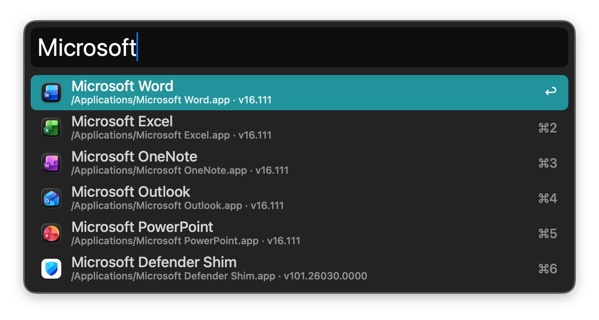

# Pennyworth

A fast, keyboard-first local launcher for macOS, in the style of Alfred.
Use it to do these tasks:

- Search applications and files
- Open web searches
- Evaluate calculations
- Run a small set of system commands

There is no account, no telemetry, and no direct network request. The app's
only dependency is the `KeyboardShortcuts` package. Keep the package at
`1.10.0`. See `Package.resolved`.



## Build

You must have these tools:

- macOS 26.0 or later on Apple silicon
- Xcode 26.6 (Swift 6, strict concurrency)

Initialize the [XcodeGen 2.46.0](https://github.com/yonaskolb/XcodeGen)
submodule after you clone the repository:

```sh
git submodule update --init
```

The `Makefile` builds XcodeGen locally with Swift Package Manager. Use it to
generate, build, and test the project:

```sh
make build
make test
```

The targets run `make generate` before they run Xcode. The other targets are:

| Target | Action |
| --- | --- |
| `make generate` | Generate `Pennyworth.xcodeproj`. |
| `make release` | Generate the project and build the Release configuration. |
| `make install` | Build Release and replace `~/Applications/Pennyworth.app`. |
| `make run` | Install and open the app. |

The automated test run covers the parser, the ranking, fuzzy matching, the
calculator, and the URL policy. It also covers template validation. The
judged corpus under `PennyworthTests/` contains 63 assertions. UI tests
require manually configured code signing. The default test action does
not run them.

## Local release install

1. Create the local Applications directory, then build, install, and open Pennyworth:

   ```sh
   mkdir -p "$HOME/Applications"
   make run
   ```

2. Open Settings from the status bar. Enable Launch at Login.

The app uses ad hoc signing (`Sign to Run Locally`). If macOS rejects the
signature after a build, open Login Items in System Settings. Add the app
manually. After you replace an installed build, recheck `Launch at Login`
in Settings. If the setting is still stale, unregister and register the
app again.

Application data is stored at:
`~/Library/Application Support/com.local.pennyworth/pennyworth.sqlite3`

## Shortcuts

| Key | Behavior |
| --- | --- |
| Option-Space (configurable) | Toggle Pennyworth |
| Up / Down | Change selection |
| Return | Run the primary action |
| Command-Return | Reveal the selection in Finder |
| Command-Y | Quick Look for a file |
| Command-C | Copy the selected path, URL, or result |
| Right arrow at end | Open the action list |
| Left arrow | Return from the action list |
| Command-1 .. 9 | Run the result at that position |
| Escape | Clear the query, then close |

## Layout

```
Pennyworth/
  App/            application lifecycle
  PennyworthPanel/ panel UI, actions, Quick Look
  Search/         query parsing, coordinator, ranking
  Providers/      application, file, web, calculator, command providers
  Actions/        result actions and execution
  Persistence/    SQLite store, web searches, app settings
  Infrastructure/ hotkey, login item, icons, signposts
  Settings/       SwiftUI settings windows
PennyworthTests/  unit + judged corpus tests
PennyworthUITests/ UI smoke test
```